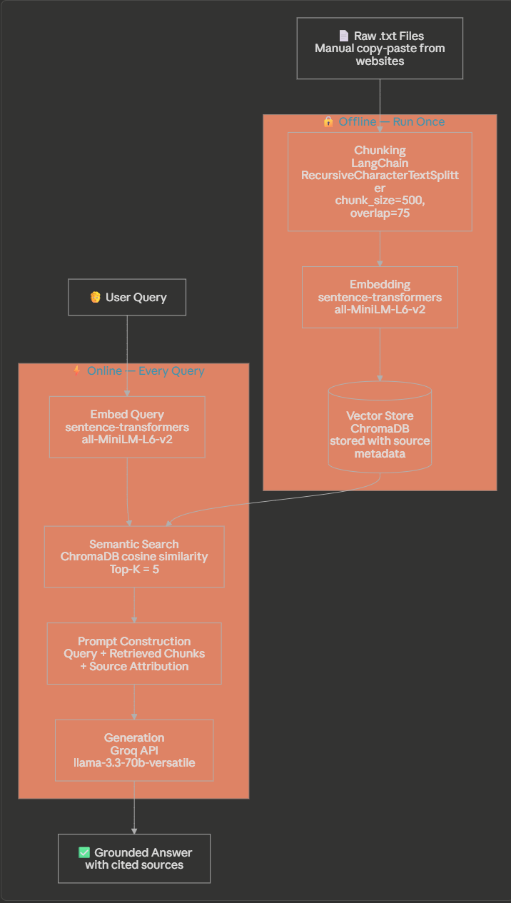

# Project 1 Planning: The Unofficial Guide

> Write this document before you write any pipeline code.
> Your spec and architecture diagram are what you'll use to direct AI tools (Claude, Copilot, etc.) to generate your implementation — the more specific they are, the more useful the generated code will be.
> Update the Retrieval Approach and Chunking Strategy sections if you change your approach during implementation.
> Update this file before starting any stretch features.

---

## Domain

<!-- What domain did you choose? Why is this knowledge valuable and hard to find through official channels? -->

My domain I chose is "Everything Computer Science" for CUNY College of Staten Island. This will give students useful information about the Computer science department and major at CSI. Students can for example ask about courses offered, the different programs and specializations, Research, The faculty, etc.

---

## Documents

<!-- List your specific sources: URLs, subreddit names, forum threads, or file descriptions.
     Aim for at least 10 sources that together cover different subtopics or perspectives within your domain. -->

| # | Source | Description | URL or location |
|---|--------|-------------|-----------------|
| 1 | CS Home page|Computer science at College of staten island official home page | https://www.cs.csi.cuny.edu/index.html |
| 2 | CS Faculty|CS Faculty all prof and staff info|https://www.cs.csi.cuny.edu/people.html |
| 3 |CSI CS page|CSI official CS page |https://www.csi.cuny.edu/academics-and-research/departments-programs/computer-science |
| 4 |Graduate page|CS graduate program page |https://www.cs.csi.cuny.edu/graduate.html |
| 5 | CS Undergrad page|CS undergrad information page |https://www.cs.csi.cuny.edu/undergraduate.html |
| 6 | CS Roadmap| Computer science Sample Road map carrer map |https://www.csi.cuny.edu/sites/default/files/pdf/academciadvisement/PathwaysAcadPlans/ComputerScienceBS_DegreeMap.pdf|
| 7 | Course Catalog|Computer Science Course Catalog |https://csi-undergraduate.catalog.cuny.edu/departments/CSC-CSI/courses |
| 8 | Course Catalog V2| More course catalog|https://www.cs.csi.cuny.edu/courses.html |
| 9 |Mandatory Core CS course|CSC 126|https://csi-undergraduate.catalog.cuny.edu/courses/0626561/general-aoYks |
| 10 | Mandatory Core CS course|CSC 211|https://csi-undergraduate.catalog.cuny.edu/courses/0626631/general-aoYks |
| 11 |Mandatory Core CS course |CSC 326 |https://csi-undergraduate.catalog.cuny.edu/courses/0626831/general-aoYks |
| 12 | Mandatory Core CS course|CSC 382 | https://csi-undergraduate.catalog.cuny.edu/courses/0626991/general-aoYks|

---

## Chunking Strategy

<!-- How will you split documents into chunks?
     State your chunk size (in tokens or characters), overlap size, and explain why those
     numbers fit the structure of your documents.
     A review-heavy corpus warrants different chunking than a long FAQ. -->

**Chunk size: 500 characters**

**Overlap: 75 characters**

**Using Langchains RecursiveCharacterTextSplitter**

**Reasoning: I will use recursive character splitting, since the document is of mixed types, and have some structure to it, My sources are Structered and factual, course deccriptions, faculty bios, program requirements, They are not flowing essays, they're short and dnese paragraphs where each part is a complete idea, 500 characters is about 2-5 sentences, enough to captuer a complete fact like a course description, too large might merge unrelated courses, too small will cut descriptions in half.**

---

## Retrieval Approach

<!-- Which embedding model are you using (e.g., all-MiniLM-L6-v2 via sentence-transformers)?
     How many chunks will you retrieve per query (top-k)?
     If you were deploying this for real users and cost wasn't a constraint, what tradeoffs
     would you weigh in choosing a different embedding model — context length, multilingual
     support, accuracy on domain-specific text, latency? -->

**Embedding model: sentence-transformers (all-MiniLM-L6-v2) Runs locally — no API key, no rate limits**

**Vector Store: ChromaDB**

**Top-k: 5**

**Production tradeoff reflection: for this project the all-MiniLM-L6-v2 runs locally with no API cost or rate limit, ideal for this type of practice development, IF it was a real deployment I would weight stuff like accuracy, OpenAI embedding model producs more high quality embeddings, but it's paid, open AI's embedding produces more context lenght aroudn 8k tokens whereas all-MiniLM-L6-v2 is only 256 token imput limit,**

---

## Evaluation Plan

<!-- List your 5 test questions with their expected correct answers.
     Questions should be specific enough that you can judge whether the system's response
     is right or wrong. "What are good dining halls?" is too vague.
     "What do students say about wait times at [dining hall name] during lunch?" is testable. -->

| # | Question | Expected answer |
|---|----------|-----------------|
| 1 |What are some core courses that I will take in the computer science major?|CSC 126, CSC 211, CSC326 CSC 382  |
| 2 |what are the Computer Science Specializaitons?|Game Dev, Networking and Security, High Performance Computing, Data Science |
| 3 |What AI related or maching learning courses are offered at CSI?|CSC 412, CSC 245, CSC 480, CSC 735 |
| 4 |What are the required courses for the Masters of Computer Science at CSI?|CSC 716, CSC 727, CSC 740, CSC 759 |
| 5 |Who is the Distinguished professor in the CS department?|Sos Agaian |
| 6 |What is CSC 777 about?|There is no CSC 777 |

---

## Anticipated Challenges

<!-- What could go wrong? Name at least two specific risks with reasoning.
     Consider: noisy or inconsistent documents, missing source attribution, off-topic
     retrieval, chunks that split key information across boundaries. -->

1.Since there is no specifics that point out to core courses it may just give random courses.

2.it might hallucinate for courses that are not there?

---

## Architecture

<!-- Draw a diagram of your pipeline showing the five stages:
     Document Ingestion → Chunking → Embedding + Vector Store → Retrieval → Generation
     Label each stage with the tool or library you're using.
     You can use ASCII art, a Mermaid diagram, or embed a sketch as an image.
     You'll use this diagram as context when prompting AI tools to implement each stage. -->

---

## AI Tool Plan

<!-- For each part of the pipeline below, describe:
     - Which AI tool you plan to use (Claude, Copilot, ChatGPT, etc.)
     - What you'll give it as input (which sections of this planning.md, which requirements)
     - What you expect it to produce
     - How you'll verify the output matches your spec

     "I'll use AI to help me code" is not a plan.
     "I'll give Claude my Chunking Strategy section and ask it to implement chunk_text()
     with my specified chunk size and overlap" is a plan. -->

For the Chunking Part I will ask Claude to generate the code to chunk the text data in the data folder which holds all the txt files of the web content using LangChainsRecursiveCharacterTextSplitter .

For Embedding I will ask Claude to generate code to embedd the chunks using all-MiniLM-L6-v2

for Vector Store I will ask claude to set that up with ChromaDB

For the online retrieval poriton I will ask claude to geneate code to Embed the query, 
Then Semantic search the ChromaDB using Cosine Similairty with top K=5 and return that to be used for a prompt. 
Claude will generate a prompt template iwth the chunks and original query, also safe guard to base the answer off of the context chunks retrieved and to also put the source file which the chunks came from, 
Then it shoudl call the GroQ API to generate the Response, 

After that I will make a clean and Simple UI verison of it using Gradio.

**Milestone 3 — Ingestion and chunking:**

Loaded 12 documents from data/

Total chunks: 175

============================================================
5 REPRESENTATIVE CHUNKS
============================================================

--- Chunk 1 (index 0) | source: ComputerScienceBS_DegreeMap.pdf ---
Page 1 of 2
SAMPLE CAREER DEGREE MAP
Computer Science BS
2025-PRESENT | Total Credits Required: 124
Year One - First Semester Degree Requirements   Year One - First Semester Career Readiness
Course Number & Title Min. Grade Cr. Recommended Career Readiness Activities Done
ENG 111 ENGLISH COMPOSITION 3 Activate your Career Services Handshake
MTH 123 COLLEGE ALGEBRA & TRIG OR MTH Start Building a Basic Resume
125 COLLEGE ALGEBRA & TRIG WITH ALG. REV. 4 Review Major Required Courses
[486 chars]

--- Chunk 2 (index 43) | source: CourseCatalogWDescription.txt ---
CSC 245 Introduction to Data Science    Basic concepts in data science. Topics covered are data collection, integration, management, modeling, analysis, visualization, prediction and decision making, data security and data privacy. Important statistical methods will be explored. Emphasis w...
[290 chars]

--- Chunk 3 (index 87) | source: CSC326.txt ---
Regular Non-Liberal Arts
Prerequisites & Corequisites
PQ CSC 211 with a grade of C or higher or ENS 336
Components
Name
Lecture
[127 chars]

--- Chunk 4 (index 131) | source: Graduate.txt ---
Discrete Mathematics, Calculus
    Probability or Linear Algebra
Students who satisfy the requirements listed above will be admitted as matriculated graduate students.
[167 chars]

--- Chunk 5 (index 174) | source: Undergraduate.txt ---
6. Apply computer science theory and software development fundamentals to produce computing-based solutions.​

BS Program Enrollment
[132 chars]

**Milestone 4 — Embedding and retrieval:**

**Milestone 5 — Generation and interface:**
